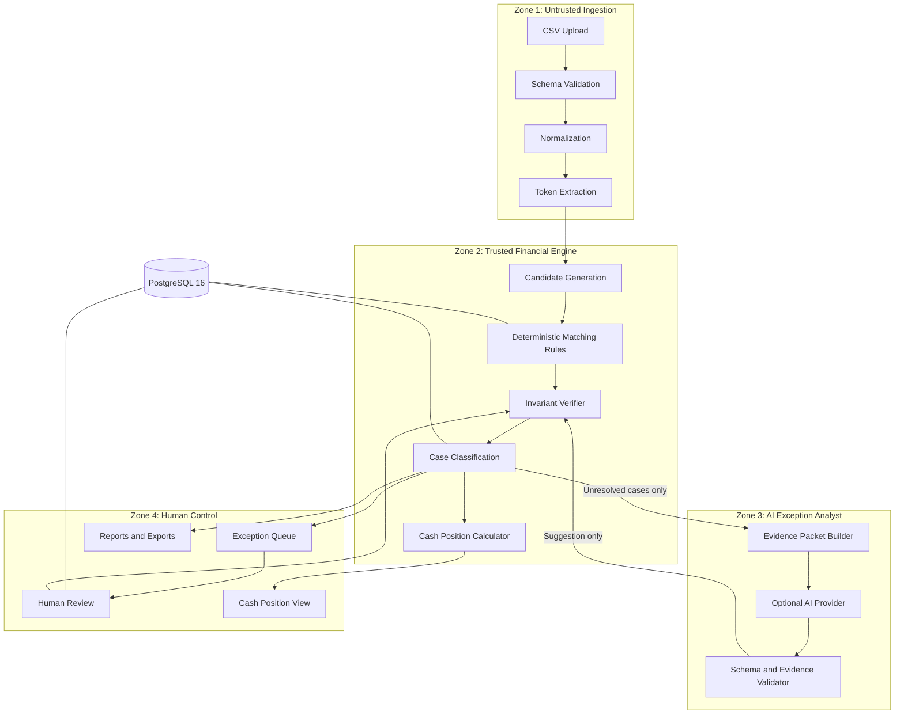

# ClearLedger Architecture Decision Record

- Status: Accepted
- Date: 2026-08-31
- Scope: Phase 0 decision lock

## Context

ClearLedger is an evidence-first settlement controller for the Razorpay Buildathon Track 04,
"AI Finance Controller." It closes one payment-to-settlement-to-bank reconciliation loop and
publishes a cash position separated by evidentiary confidence. The system favors conservative,
reproducible financial proof over forced match coverage.

## Locked Decisions

1. **Product name:** ClearLedger.
2. **Backend:** FastAPI on Python 3.12 or 3.13. Python 3.14 is not a supported runtime for this
   project until dependency compatibility is explicitly verified. Local development is pinned
   to Python 3.13.
3. **Frontend:** Next.js, TypeScript, Tailwind CSS, and Lucide React icons.
4. **Database:** PostgreSQL 16 in Docker, configured for UTF-8 and UTC.
5. **ORM and migrations:** SQLAlchemy 2.x and Alembic.
6. **Money representation:** authoritative money is integer paise in PostgreSQL `BIGINT`
   columns. Floats, `REAL`, and scaled `NUMERIC` columns are prohibited for authoritative money.
   A verified case requires an exact zero-paise residual; materiality thresholds do not relax
   this invariant.
7. **AI:** one optional provider may return strict structured JSON. AI operates only on bounded
   unresolved-case packets, and its output is schema and evidence validated. AI cannot mark a
   case `VERIFIED` or `RECONCILED`.
8. **Evaluation:** a separate evaluator compares exported predictions with hidden ground truth.
   Ground truth is isolated from application imports, database access, and reconciliation
   runtime paths.
9. **Async jobs:** reconciliation jobs run in-process initially. A queue will be introduced only
   after measured latency, concurrency, or durability needs justify it.
10. **P0 scope:** settlement reconciliation and cash-confidence buckets.
11. **P1 scope:** grounded settlement Q&A and a seven-day deterministic cash outlook.
12. **External actions:** no autonomous financial writes. ClearLedger does not move money, post
   journals, initiate payouts or refunds, or mutate source financial systems.

## Component Flow

```text
Next.js UI
    -> FastAPI run service
        -> ingestion & validation
        -> normalization
        -> candidate generation
        -> reconciliation engine
        -> invariant verifier
        -> AI analyst (bounded, unresolved cases only)
        -> human review service
        -> cash-position service
        -> evaluator & report exporter
    -> PostgreSQL
```

The diagram shows the operator-facing flow. The evaluator is a separate package/process: the API
may export predictions for it, but the reconciliation runtime never imports evaluator-only truth.

## Trust-Zone Diagram



The return edge from AI to the invariant verifier does not grant AI authority. It means a cited,
precomputed candidate is rechecked by deterministic code before it can be shown as a suggestion.
Only a valid deterministic relationship or an invariant-gated human action can affect case state.

## Runtime Components

| Component | Responsibility | Authoritative? |
|---|---|---|
| Next.js web | Setup, control room, evidence, review, cash, audit, exports | No |
| FastAPI API | Validated orchestration, transactions, idempotency, error envelopes | Control plane |
| Ingestion and normalization | Preserve raw rows and create typed canonical facts | Facts only |
| Reconciliation engine | Candidate rules, allocations, invariants, classification | Yes |
| AI analyst | Bounded hypothesis and candidate ranking for eligible exceptions | No |
| Review service | Typed operator actions rechecked against invariants | Conditionally |
| PostgreSQL | Durable source, evidence, case, decision, and audit records | System of record |
| Standalone evaluator | Compare exported predictions to isolated ground truth | Evaluation only |

## Reproducibility Boundary

Each run binds source-file SHA-256 checksums, a dataset checksum, policy ID/version, rule-set
version, application version, AI model/prompt metadata, and a result checksum. The synthetic
generator is seeded. `scripts/verify_claims.py` generates the same seed twice and requires both
the source checksums and case predictions to match.

## Deployment

`docker-compose.yml` starts PostgreSQL, runs Alembic before the API becomes healthy, and then
starts the web application. Uploaded files use a named volume. The web bundle addresses the API
through the browser-reachable `http://localhost:8000/api` origin; service-to-service database
traffic remains on the Compose network.

## Trust Zones

### Zone 1 - Untrusted ingestion

Contains uploaded CSV bytes, bank narration, merchant references, and other external text.
Capabilities are limited to parsing, validation, normalization, and candidate-token extraction.
It cannot mutate authoritative reconciliation state. Immutable raw-row persistence is performed
through the trusted run service as an append-only record.

### Zone 2 - Trusted financial engine

Contains canonical records, versioned policies, deterministic rules, allocations, invariants,
and cash calculations. This zone is authoritative. It alone can produce verified evidence after
currency, temporal, uniqueness, lifecycle, and exact-arithmetic checks pass.

### Zone 3 - AI exception analyst

Receives bounded unresolved-case packets and returns schema-validated, non-authoritative
suggestions. It has no arbitrary database, shell, publication, or state-transition capability.
Every cited candidate and evidence ID must exist in its input packet.

### Zone 4 - Human control and publication

Owns approvals, rejections, deferrals, assignments, task creation, report publication, and
audited state transitions. Human approval still cannot bypass the deterministic invariant
verifier.

## Consequences

- Raw input remains immutable and missing values remain distinct from zero.
- Candidate ranking can be permissive, while acceptance remains conservative.
- Every verified allocation is unique, versioned, and reproducible.
- AI outages cannot prevent deterministic completion.
- Redis, Kafka, Kubernetes, OCR, vector databases, and multiple model providers are excluded
  until a measured requirement appears.
